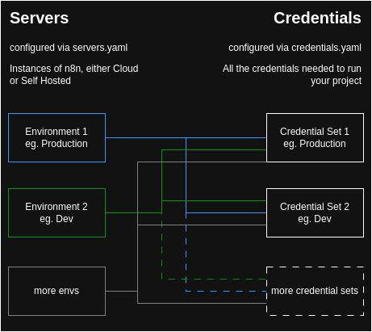

# n8n porter

## A N8N Workflow & Credentials Migration Tool

A Python-based tool for managing n8n workflows across different environments. This tool helps you backup, restore, and clean up workflows and credentials in n8n instances.

 - Export projects + credentials
 - Restore projects 
   - to different servers
   - using different sets of credentials
   - replacing strings on import/export

#### How it works


## Features

- **Backup Workflows**: Save all workflows from an n8n instance to local storage
- **Restore Workflows**: Restore workflows to a target n8n instance with proper dependency handling
- **Cleanup Resources**: Safely delete all workflows and credentials from an instance
- **Smart Dependency Resolution**: Automatically detects and handles workflow dependencies
- **Environment Management**: Supports multiple environments with proper credential mapping and postfix handling
- **Project Support**: Works with both project-based and non-project n8n instances
- **Resource Mapping**: Maintains a mapping of resources across instances for better tracking
- **String Replacements**: Handles environment-specific value replacements in workflows

#### Version differences
> ⚠️ **IMPORTANT: N8N Version Differences**
> 
> The tool handles both Community and Enterprise versions of n8n
> When using the tool:
> - Community version: All operations affect the entire server
> - Enterprise version: You must select a project for operations
> 
> Make sure to set `supports_projects: false` in your `servers.yaml` for Community instances.

## Prerequisites

- Python 3.6 or higher
- Required Python packages:
  - requests
  - pyyaml
  - python-dotenv

## Credential Schema Management

The tool includes a credential schema management feature that helps you create and maintain your `credentials.yaml` file. This feature allows you to:

1. **Download Credential Schemas**
   - Fetch the latest credential schemas from your n8n instance
   - Supports all credential types used in your workflows
   - Schemas are saved locally for offline reference

2. **View Example Configurations**
   - Generate example credential configurations based on schemas
   - Shows all required fields and their types
   - Includes field descriptions from the schema
   - Outputs in the correct format for `credentials.yaml`

To use the credential schema management:

```bash
python credential_schemas.py
```

The tool will present you with options to:
1. Download credential schemas from a server
2. View example credential configurations
3. Exit

### Example Output

When viewing a credential example, you'll see output like this:

```yaml
environments:
  production:
    name: Production Environment
    postfix: Prod
    credentials:
      telegramapi:
        type: telegramApi
        name: Example telegramApi Credential
        data:
          # accessToken: The Telegram Bot API access token
          accessToken: example_string_value
          # baseUrl: The base URL for the Telegram API
          baseUrl: example_string_value
          # additionalParameters: Any additional parameters to include in requests
          additionalParameters: {}
  development:
    name: Development Environment
    postfix: Dev
    credentials:
      telegramapi:
        type: telegramApi
        name: Example telegramApi Credential
        data:
          # accessToken: The Telegram Bot API access token
          accessToken: example_string_value
          # baseUrl: The base URL for the Telegram API
          baseUrl: example_string_value
          # additionalParameters: Any additional parameters to include in requests
          additionalParameters: {}
```

This helps you:
- Understand what fields are required for each credential type
- See the correct structure for your `credentials.yaml`
- Get field descriptions and types
- Generate proper examples for both production and development environments

## Setup

1. Clone the repository
2. Install required packages:
   ```bash
   pip install -r requirements.txt
   ```

3. Create configuration files:

### servers.yaml
Create a `servers.yaml` file with your n8n instance configurations:

```yaml
servers:
  local:
    name: "Local n8n"
    url: "http://localhost:5678"
    api_key: "your-api-key"
    supports_projects: true

  production:
    name: "Production n8n"
    url: "https://n8n.your-domain.com"
    api_key: "your-api-key"
    supports_projects: true
```

### credentials.yaml
Create a `credentials.yaml` file to manage environment-specific credentials and replacements:

```yaml
environments:
  production:
    name: "Production Environment"
    postfix: "Prod"  # Optional postfix for credential names
    credentials:
      telegram_bot:
        type: telegramApi
        name: "Telegram Bot"
        data:
          accessToken: "your-prod-token"
          baseUrl: "https://api.telegram.org"

  development:
    name: "Development Environment"
    postfix: "Dev"
    credentials:
      telegram_bot:
        type: telegramApi
        name: "Telegram Bot"
        data:
          accessToken: "your-dev-token"
          baseUrl: "https://api.telegram.org"

# String replacements between environments
replacements:
  web_service_url:
    description: "The base URL of the web service"
    values:
      production: "https://api.example.com"
      development: "http://127.0.0.1"
      staging: "https://staging.api.example.com"
```

## Usage

Run the tool:
```bash
python main.py
```

The tool will present you with three options:

1. **Backup workflows**
   - Select source server
   - Select project (if supported)
   - Workflows will be saved to `data/backup_[project]_[timestamp]/workflows/`

2. **Restore workflows**
   - Select target server
   - Select project (if supported)
   - Choose target environment (production/development/staging)
   - Select backup to restore from
   - Tool will:
     - Create credentials with proper environment postfixes
     - Analyze workflow dependencies
     - Create workflows in correct order
     - Update all references and mappings
     - Apply environment-specific string replacements

3. **Delete tracked workflows and credentials**
   - Select target server
   - Confirm deletion
   - Tool will safely remove ONLY the workflows and credentials that were automatically created
   - Only affects resources tracked in resource_mapping.json
   - Manually created resources are not affected
   - If no tracked resources are found, the operation is skipped

## Environment Management

### Credential Postfixes
- Each environment can have an optional postfix (e.g., "Prod", "Dev", "Staging")
- Postfixes are automatically handled in credential names
- Existing postfixes are removed before adding new ones
- Example: "Telegram Bot" becomes "Telegram Bot Prod" in production

### String Replacements
- Each replacement has:
  - A descriptive name
  - A description of its purpose
  - Environment-specific values
- Supports multiple environments
- Values are replaced based on target environment
- Common replacements include:
  - Web service URLs
  - API endpoints
  - Channel names
  - Database connections

## Resource Mapping

The tool maintains a `resource_mapping.json` file that tracks:
- Workflow IDs across instances
- Credential IDs across instances
- Project IDs (if supported)

This mapping helps ensure proper reference handling during restore operations.

## Tips and Best Practices

1. **Backup Before Restore**
   - Always backup your target instance before restoring workflows
   - This allows you to rollback if something goes wrong

2. **Credential Management**
   - Keep your `credentials.yaml` file secure and never commit it to version control
   - Use environment variables for sensitive values
   - Use consistent naming across environments
   - Leverage postfixes for environment distinction

3. **String Replacements**
   - Use descriptive names for replacements
   - Document the purpose of each replacement
   - Keep environment values organized
   - Test replacements in development first

4. **Dependency Handling**
   - The tool automatically detects workflow dependencies
   - Workflows are created in the correct order
   - Circular dependencies are detected and prevented

5. **Project Support**
   - For project-based instances, make sure to select the correct project
   - The tool handles both project and non-project instances automatically

6. **Error Handling**
   - The tool provides detailed error messages
   - Failed operations are logged
   - Partial restores are cleaned up automatically

## Troubleshooting

1. **API Key Issues**
   - Verify your API keys in `servers.yaml`
   - Ensure the API key has necessary permissions

2. **Connection Problems**
   - Check if the n8n instance is accessible
   - Verify the URL in `servers.yaml`

3. **Credential Mapping**
   - If credentials aren't mapping correctly, check the naming in `credentials.yaml`
   - Ensure credential types match between environments
   - Verify postfix handling is working as expected

4. **String Replacements**
   - If values aren't being replaced, check the replacements configuration
   - Verify the target environment exists in the replacements
   - Ensure the values match exactly in the workflows

5. **Workflow Dependencies**
   - If a workflow fails to restore, check its dependencies
   - Verify all dependent workflows are present in the backup

## Contributing

Feel free to submit issues and enhancement requests!